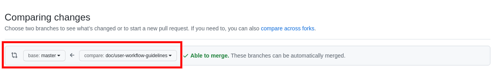
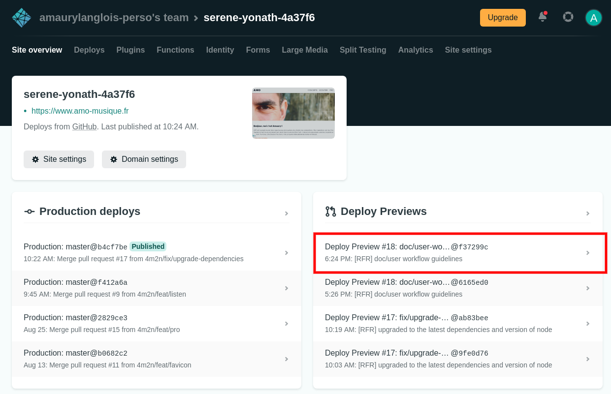
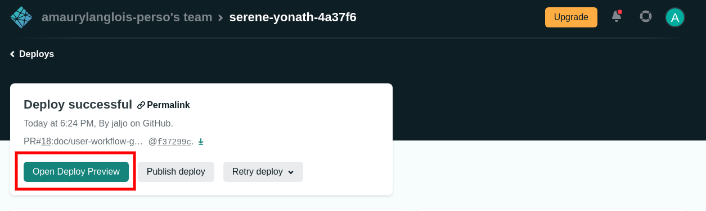
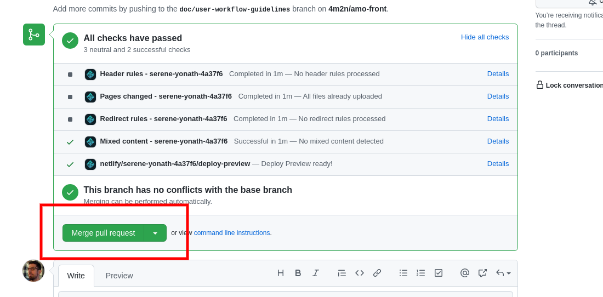

# Deployment procedure

This document gives instructions on how to deploy your changes on production,
along with general advices on how to push modifications to the data files.

## Requirements

- git should be installed on your computer
- you should have a github account
- permissions to access the [repository](https://github.com/4m2n/amo-front)

## Modifying the data files

1) Ensure you're up to date with the master branch :

`$ git pull origin master`

2) Create a dedicated branch that will hold your changes :

`$ git checkout -b data/lyrics-modification`

:warning: **NEVER PUSH YOUR CHANGES DIRECTLY ON THE MASTER BRANCH !** :warning:

Always create a branch for your modifications. It will give you the opportunity
to check your changes on preproduction before deploying them on production.

3) Once you've made the modifications you want on the data or on the static
files and you're happy with the result, commit your changes and push them to
your branch :

```bash
$ git commit -m "correction of a typo in pauline lyrics"
$ git push origin data/lyrics-modification
```

## Checking the result on preproduction and deploying to production

4) Open a [pull request](https://github.com/4m2n/amo-front/compare). The
`compare` branch should be the branch you just created
(`data/lyrics-modification` in this example), and the base branch should be
`master`.



5) Go to the Netlify project
[dashboard](https://app.netlify.com/sites/serene-yonath-4a37f6/overview).
Check your changes live by clicking the latest build link (you may have to wait
a little bit until it finishes) and then click on the `Open Deploy Preview`
button.





6) Assert that you didn't throw a monkey wrench in the project.

7) Merge your pull request. You can ask me for a review if you're not sure.


